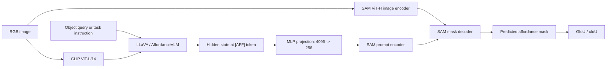

# RAGNet Reproduction on RIT TIGRIS

> 这是本仓库的本地复现说明，记录我们在 RIT TIGRIS 上实际使用的环境、数据、模型、脚本和实验结果。
> 官方项目介绍仍见 [`README.md`](README.md)；不要用本文替代论文或官方文档。

最后更新：2026-07-30

## 1. 当前状态

已经完成：

- 在 `ragnet` Conda 环境中跑通 AffordanceVLM-7B 单图推理。
- 下载并校验 RAGNet 官方数据包。
- 从 HANDAL 官方来源补齐 17 类 without-depth 数据。
- 跑完 7 个约 1,000 样本的官方验证集。
- 将完整 HANDAL（65,827 张）评估提交到 TIGRIS 独占 GH200。

尚未完成：

- 当前完整 HANDAL 作业 `23247` 仍在运行，最终指标尚未写入本文。
- 尚未复现官方完整训练。
- 尚未下载官方训练所需的 LISA 通用分割、ReferSeg、VQA 和 ReasonSeg 数据。
- 官方单机 8 GPU 训练脚本尚未改写为 TIGRIS 多节点版本。

当前结论：**官方 checkpoint 的推理和评估链路已经复现；完整训练链路还没有复现。**

## 2. 项目在做什么

RAGNet 的核心任务是：给定图像和自然语言任务或对象名称，预测目标物体上适合抓取/操作的 affordance 区域。

模型的数据流如下：



关键连接点是特殊 token `[AFF]`：

1. CLIP 和 LLaVA 共同编码图像与文本。
2. 取 `[AFF]` 位置的语言隐藏状态。
3. 用 `text_hidden_fcs` 将 4096 维隐藏状态映射到 256 维。
4. 将它作为文本 prompt embedding 送入 SAM。
5. SAM mask decoder 输出 affordance 二值掩码。

## 3. 关键代码

| 文件 | 作用 | 当前状态 |
|---|---|---|
| [`model/AffordanceVLM.py`](model/AffordanceVLM.py) | AffordanceVLM 主模型；连接 LLaVA、`[AFF]` embedding 和 SAM；定义 CE/BCE/Dice loss | 官方核心代码 |
| [`train_aff.py`](train_aff.py) | 参数解析、数据集构建、DeepSpeed 初始化、训练循环和验证指标 | 已增加 TIGRIS eval-only 适配 |
| [`utils/dataset.py`](utils/dataset.py) | 混合训练数据集、batch collate、conversation tokenization | 官方核心代码 |
| [`utils/aff_seg_dataset.py`](utils/aff_seg_dataset.py) | 普通 affordance 训练/验证数据；HANDAL、GraspNet、3DOI 等 | 官方核心代码 |
| [`utils/reason_aff_dataset.py`](utils/reason_aff_dataset.py) | reasoning-based affordance 训练/验证数据 | 官方核心代码 |
| [`utils/utils.py`](utils/utils.py) | IoU 统计、CUDA 搬运、meter 等公共函数 | 官方核心代码 |
| [`chat.py`](chat.py) | 单图自由文本推理，保存预测 mask 和叠加图 | 已增加非交互 `--prompt/--image` 模式 |
| [`app.py`](app.py) | Gradio demo | 尚未作为复现主入口 |
| [`scripts/evaluate_tigris.sh`](scripts/evaluate_tigris.sh) | 我们在 TIGRIS 上使用的统一评估入口 | 已验证 |
| [`scripts/evaluate.sh`](scripts/evaluate.sh) | 官方顺序评估脚本，路径和 CUDA 配置不适合直接在 TIGRIS 运行 | 仅供参考 |
| [`scripts/train.sh`](scripts/train.sh) | 官方单机 8 GPU 训练命令 | 尚未适配 TIGRIS |
| [`merge_lora_weights_and_save_hf_model.py`](merge_lora_weights_and_save_hf_model.py) | 将训练后的 LoRA/DeepSpeed 权重导出为 Hugging Face checkpoint | 尚未在本次复现中使用 |
| [`data_curation/check_dataset.py`](data_curation/check_dataset.py) | 校验官方 pickle 引用的数据是否存在 | 已验证通过 |

### 我们对 `train_aff.py` 的最小修改

`--eval_only` 时：

- 不再构建 `HybridDataset` 训练集。
- 不再开启 input gradients 和 gradient checkpointing。
- 不再构建训练 optimizer/dataloader。
- 使用 DeepSpeed ZeRO stage 0 做单 GPU 评估。

这些修改只绕开评估时不需要的训练初始化，不改变模型预测、mask 后处理或 GIoU/cIoU 计算。

## 4. 模型与 checkpoint

### AffordanceVLM-7B

- Hugging Face：[`Dongming97/AffordanceVLM`](https://huggingface.co/Dongming97/AffordanceVLM)
- 本地目录：

  ```text
  /shared/rc/mairl/results/ragnet-reproduction/models/AffordanceVLM-7B
  ```

- 大小：约 16 GB。
- 模型类：`AffordanceVLMForCausalLM`。
- 基座配置：LLaVA-Lightning-7B-v1-1。
- hidden size：4096。
- checkpoint 已经是合并后的完整模型；评估时使用 `--lora_r 0`，避免再次注入随机 LoRA 层。

### CLIP vision tower

- 模型：`openai/clip-vit-large-patch14`
- 本地 Hugging Face cache：

  ```text
  /scratch/dg5804/ragnet/cache/huggingface
  ```

### SAM

- 模型：SAM ViT-H。
- checkpoint：

  ```text
  /shared/rc/mairl/results/ragnet-reproduction/models/sam_vit_h_4b8939.pth
  ```

- 大小：约 2.4 GB。
- SHA-256：

  ```text
  a7bf3b02f3ebf1267aba913ff637d9a2d5c33d3173bb679e46d9f338c26f262e
  ```

### 训练时哪些参数会更新

官方训练逻辑冻结：

- CLIP vision tower。
- LLaVA multimodal projector。
- SAM image encoder 和 prompt encoder。

官方训练逻辑更新：

- LLaVA `q_proj` / `v_proj` 的 LoRA 参数。
- token embedding 与 `lm_head`。
- `text_hidden_fcs` 投影层。
- SAM mask decoder。

## 5. Conda 环境

环境位置：

```text
/home/dg5804/miniconda3/envs/ragnet
```

激活：

```bash
source "$HOME/miniconda3/etc/profile.d/conda.sh"
conda activate ragnet
```

已经验证的关键版本：

| 包 | 版本 |
|---|---:|
| Python | 3.9.25 |
| PyTorch | 2.5.1+cu124 |
| torchvision | 0.20.1 |
| transformers | 4.31.0 |
| PEFT | 0.4.0 |
| Accelerate | 0.21.0 |
| DeepSpeed | 0.19.3 |
| SciPy | 1.11.2 |
| scikit-image | 0.21.0 |
| OpenCV | 4.8.0 |

注意：

- 官方 [`requirements.txt`](requirements.txt) 仍固定到 PyTorch 1.13.1 + CUDA 11.7，不应在当前环境中重新无脑执行，否则可能降级已经验证的 PyTorch。
- TIGRIS 是 Linux AArch64；PyTorch/torchvision wheel 可用性与常见 x86_64 机器不同。
- 当前没有安装 FlashAttention，但所有已完成推理和评估都不需要它。
- 完整训练前再单独验证适合 AArch64、PyTorch 2.5.1 和 CUDA 12.4 的 FlashAttention。
- 检查当前环境是否存在依赖冲突：

  ```bash
  python -m pip check
  ```

## 6. 数据集与存储位置

### 存储分层

| 内容 | 位置 | 说明 |
|---|---|---|
| Git 仓库和 Conda 环境 | `/home/dg5804` | 小文件、代码、环境 |
| 原始数据 | `/shared/rc/mairl/datasets/ragnet/raw` | MAIRL 持久化存储，约 123 GB |
| 解压数据 | `/shared/rc/mairl/datasets/ragnet/processed/data` | MAIRL 持久化存储，约 127 GB |
| 模型和实验结果 | `/shared/rc/mairl/results/ragnet-reproduction` | MAIRL 持久化存储 |
| 高频小型验证子集 | `/scratch/dg5804/ragnet/data` | Scratch，约 4.9 GB，可能按集群策略清理 |
| HF/编译缓存 | `/scratch/dg5804/ragnet/cache` | 可重新生成 |

不要把唯一 checkpoint 或唯一实验结果只放在 Scratch。

### 下载的数据

#### RAGNet 官方数据包

- 来源：[`Dongming97/RAGNet`](https://huggingface.co/datasets/Dongming97/RAGNet)
- 文件：

  ```text
  /shared/rc/mairl/datasets/ragnet/raw/data.zip
  ```

- 大小：37,687,969,525 bytes。
- SHA-256：

  ```text
  220616e3df60ca741f24b31ad60af51ca2bd6d5729a0b7577d3a23e821e72784
  ```

- `unzip -t` 完整性检查已通过。

它提供以下本地数据和索引：

- Open-X：约 398 MB。
- EgoObjects：约 4.4 GB。
- GraspNet：约 31 GB。
- RLBench：约 1.6 GB。
- 3DOI：约 376 MB。
- 训练/验证 pickle 索引。

#### HANDAL

- 来源：[`NVlabs/HANDAL`](https://github.com/NVlabs/HANDAL)
- 下载的是 17 个类别的 `without_depth` 压缩包。
- 解压目录：

  ```text
  /shared/rc/mairl/datasets/ragnet/processed/data/HANDAL/without_depth
  ```

- 解压后约 90 GB。
- 17 个 zip 均通过 CRC 检查。
- 完整 test split 共 65,827 张 RGB 图像，每张预期的 handle mask 均存在。

### 当前目录结构

```text
/shared/rc/mairl/datasets/ragnet/processed/data/
├── HANDAL/without_depth/
├── openx/{images,masks}/
├── egoobjects/{images,masks}/
├── graspnet/
│   ├── images/
│   ├── masks/
│   ├── test_seen/
│   └── test_novel/
├── rlbench/{images,masks}/
├── 3doi/{images,masks}/
├── openx_train.pkl
├── egoobjects_train.pkl
├── graspnet_train.pkl
├── rlbench_train.pkl
├── handal_hard_reasoning_train.pkl
├── egoobjects_easy_reasoning_train.pkl
├── egoobjects_hard_reasoning_train.pkl
├── handal_mini_val.pkl
├── graspnet_test_seen_val.pkl
├── graspnet_test_novel_val.pkl
├── 3doi_val.pkl
├── handal_easy_reasoning_val.pkl
├── handal_hard_reasoning_val.pkl
└── 3doi_easy_reasoning_val.pkl
```

### 完整训练仍缺少的数据

官方 `scripts/train.sh` 还使用以下 LISA 数据，它们目前不在
`/shared/rc/mairl/datasets/ragnet/processed/data`：

- ADE20K、COCO-Stuff、Pascal-Part、PACO-LVIS、Mapillary。
- RefCOCO、RefCOCO+、RefCOCOg、RefCLEF。
- LLaVA Instruct/VQA 数据。
- ReasonSeg。

因此，**当前数据足以复现官方 affordance 评估，但不足以直接复现官方完整混合训练。**

## 7. 评估实现到底输入和输出什么

### 普通 affordance segmentation

每个样本包含：

- 一张 RGB 图像。
- 一个对象类别名。
- 一个用于评分的 GT mask 或 object ID。
- 固定问题：

  ```text
  You are an embodied robot.
  What is the affordance map of {class_name} in this image?
  ```

数据集会构建包含 `[AFF]` 的完整 conversation。验证代码提取 `[AFF]`
位置的隐藏状态，再由 SAM 预测 mask。

### Reasoning-based affordance segmentation

每个样本包含：

- 一张 RGB 图像。
- 自然语言任务问题。
- 官方参考回答。
- 目标对象类别和 GT affordance mask。

easy 问题通常直接给出对象线索，例如寻找锤子；hard 问题可能只描述
“把钉子钉进墙里”，模型需要从任务推断应使用锤子并定位手柄。

### 一个重要的实现细节

官方 benchmark 的 `train_aff.py::validate()` 并不是自由生成文本：

- `AffValDataset` 会将 assistant 内容设为 `[AFF].`。
- `ReasonAffValDataset` 会把官方参考回答和 `[AFF]` 一起放入 conversation。
- `validate()` 对完整 conversation 做 forward，提取 `[AFF]` hidden state 并解码 mask。

而 [`chat.py`](chat.py) 使用 `model.evaluate()` 自回归生成回答和 `[AFF]`，
更接近真实交互推理。研究改进时应明确区分这两条路径。

### 评估输出

模型内部输出：

- 连续值 affordance mask logits。
- 用 `logit > 0` 得到二值预测 mask。

官方批量评估只持久化：

- GIoU：先计算每个样本的前景 IoU，再取平均。
- cIoU：累计所有样本的前景 intersection 和 union 后计算 IoU。

结果追加到：

```text
/shared/rc/mairl/results/ragnet-reproduction/models/AffordanceVLM-7B/eval_result.txt
```

当前批量评估不会保存逐样本预测 mask；单图 `chat.py` 会保存 mask 和
叠加可视化。

## 8. 已完成的官方评估

所有数字均为百分数。

| 验证集 | 有效样本 | 本次 GIoU | 本次 cIoU | 论文 GIoU | 论文 cIoU |
|---|---:|---:|---:|---:|---:|
| HANDAL mini（HANDAL†） | 1,003 | 60.63 | 60.04 | 60.5 | 60.3 |
| GraspNet test seen | 1,008 | 63.34 | 64.11 | 63.3 | 64.0 |
| GraspNet test novel | 1,018 | 47.26 | 35.60 | 45.6 | 33.2 |
| 3DOI affordance | 1,012 | 37.50 | 37.51 | 37.4 | 37.4 |
| HANDAL easy reasoning | 1,003 | 59.27 | 58.83 | 58.3 | 58.1 |
| HANDAL hard reasoning | 1,003 | 58.98 | 58.72 | 58.2 | 57.8 |
| 3DOI easy reasoning | 1,012 | 37.87 | 38.94 | 38.1 | 39.4 |
| HANDAL full | 65,827 | 运行中 | 运行中 | 60.3 | 60.8 |

3DOI 的两个原始 pickle 各有 1,013 条记录；官方代码跳过损坏的
`EK_frame_0000040462.jpg`，实际各评估 1,012 条。

GraspNet novel 本次结果比论文高约 1.7/2.4 个百分点。其余结果与论文
非常接近，说明 checkpoint、数据、输入模板、SAM 和指标链路已经连通。

注意：下载的 checkpoint 目录中原本就带有一条 `handal_all` 结果。
在作业 `23247` 结束前，不要把那条旧记录误认为本次完整 HANDAL 重跑结果。

## 9. 如何运行评估

### 支持的验证集名称

普通 affordance：

```text
handal_all
handal_mini
graspnet_test_seen
graspnet_test_novel
3doi
```

Reasoning affordance：

```text
handal_hard_reasoning
handal_easy_reasoning
3doi_easy_reasoning
```

### 在已有 GPU 交互会话中运行小型验证集

只在 `sinteractive` 已经分配 GPU 后执行：

```bash
cd /home/dg5804/projects/ragnet-reproduction
source "$HOME/miniconda3/etc/profile.d/conda.sh"
conda activate ragnet

bash scripts/evaluate_tigris.sh handal_mini
```

不要在登录节点直接运行模型。

### 使用 `sbatch` 运行小型验证集

```bash
sbatch --parsable \
  --time=01:00:00 \
  --job-name=ragnet-seen \
  /home/dg5804/slurm/ragnet-gpu-job.sbatch \
  bash /home/dg5804/projects/ragnet-reproduction/scripts/evaluate_tigris.sh \
  graspnet_test_seen
```

通用 wrapper 默认从 `/scratch/dg5804/ragnet/data` 读取数据。

### 使用 `sbatch` 运行完整 HANDAL

完整 HANDAL 不复制到 Scratch，直接读取 MAIRL 持久化目录：

```bash
sbatch --parsable \
  --time=04:00:00 \
  --job-name=ragnet-handall \
  /home/dg5804/slurm/ragnet-gpu-job.sbatch \
  env RAGNET_DATA=/shared/rc/mairl/datasets/ragnet/processed/data \
  bash /home/dg5804/projects/ragnet-reproduction/scripts/evaluate_tigris.sh \
  handal_all
```

### 查看 Slurm 状态和日志

```bash
squeue -j 23247
```
```bash
tail -f \
  /shared/rc/mairl/results/ragnet-reproduction/logs/ragnet-handall-23247.out
```

```bash
sacct -j 23247 \
  --format=JobID,JobName,State,Elapsed,ExitCode
```

`sbatch` 作业与 VS Code/SSH 会话解耦；关闭 VS Code 不会终止作业。

## 10. 单图 smoke test

输入：

- 图像：`vis_output/my_workspace.JPG`
- Prompt：`Please segment the affordance map of mug in this image.`

运行命令：

```bash
python -u chat.py \
  --version /shared/rc/mairl/results/ragnet-reproduction/models/AffordanceVLM-7B \
  --precision bf16 \
  --prompt "Please segment the affordance map of mug in this image." \
  --image /home/dg5804/projects/ragnet-reproduction/vis_output/my_workspace.JPG \
  --vis_save_path \
    /shared/rc/mairl/results/ragnet-reproduction/evaluations/smoke-test
```

模型文本输出：

```text
Sure, [AFF] .
```

生成文件：

```text
/shared/rc/mairl/results/ragnet-reproduction/evaluations/smoke-test/
├── my_workspace_mask_0.jpg
└── my_workspace_masked_img_0.jpg
```

预测区域覆盖了杯子把手。

## 11. 官方训练配置

官方入口是 [`scripts/train.sh`](scripts/train.sh)，主要配置为：

| 配置 | 官方值 |
|---|---:|
| GPU | 单机 8 GPU：`localhost:0...7` |
| Precision | BF16 |
| DeepSpeed | ZeRO stage 2 |
| Epochs | 10 |
| Steps per epoch | 500 |
| Batch size | 40 / GPU / step |
| Gradient accumulation | 1 |
| Optimizer | AdamW |
| Learning rate | 3e-4 |
| Warmup | 100 steps |
| LoRA | rank 8，作用于 `q_proj,v_proj` |
| CE loss weight | 1.0 |
| Mask BCE weight | 2.0 |
| Mask Dice weight | 0.5 |

训练混合数据及顶层采样权重：

```text
sem_seg : refer_seg : vqa : reason_seg : aff_seg : reason_aff
   3    :     1     :  1  :     1      :    9    :      3
```

Affordance 数据内部权重：

```text
HANDAL : Open-X : EgoObjects : GraspNet : RLBench
   2   :   2    :     4      :    2     :    1
```

Reasoning affordance 数据内部权重：

```text
HANDAL hard : EgoObjects easy : EgoObjects hard
      1     :        1        :        1
```

### 为什么现在不能直接运行官方 `train.sh`

1. 脚本硬编码 `/data/cuda/cuda-11.7`，而当前环境是 CUDA 12.4。
2. 脚本假设一台机器上有 8 张 GPU。
3. TIGRIS 每个 GH 节点只有一张 GH200；8 GPU 训练会跨 8 个节点。
4. 还缺少 LISA 通用训练数据。
5. 官方基础 LLaVA checkpoint 尚未单独放入我们的模型目录。
6. 当前只验证了 eval-only 路径，没有完成多节点训练 smoke test。

因此不要直接提交：

```bash
bash scripts/train.sh
```

### 建议的训练推进顺序

1. 保留当前官方 checkpoint 和评估结果作为不可变 baseline。
2. 先实现并验证单 GH200、小数据、少 step 的 LoRA 训练 smoke test。
3. 补齐所需训练数据，或明确只使用 affordance 子集做方法实验。
4. 新建 TIGRIS 专用训练脚本，不改写官方 `scripts/train.sh`。
5. 先跑 1 GPU baseline，再决定是否扩展到 2–8 节点 DDP/DeepSpeed。
6. 每次改动都在相同 7 个小验证集上对比，再提交完整 HANDAL。

## 12. 训练产物与合并

训练时 TensorBoard 和 checkpoint 默认位于：

```text
<log_base_dir>/<exp_name>/
├── events.out.tfevents...
├── meta_log_giou*_ciou*.pth
└── ckpt_model/
```

DeepSpeed checkpoint 转 FP32：

```bash
cd <run_dir>/ckpt_model
python zero_to_fp32.py . ../pytorch_model.bin
```

将 LoRA/训练权重合并为 Hugging Face 模型：

```bash
CUDA_VISIBLE_DEVICES="" \
python merge_lora_weights_and_save_hf_model.py \
  --version <base_llava_path> \
  --weight <run_dir>/pytorch_model.bin \
  --save_path <output_model_dir>
```

不要覆盖官方 baseline：

```text
/shared/rc/mairl/results/ragnet-reproduction/models/AffordanceVLM-7B
```

建议每个实验使用独立输出目录，例如：

```text
/shared/rc/mairl/results/ragnet-reproduction/experiments/<experiment_name>/
```

## 13. 实验结果与日志位置

```text
/shared/rc/mairl/results/ragnet-reproduction/
├── evaluations/
│   ├── smoke-test/
│   └── tensorboard/
├── logs/
│   └── ragnet-handall-23247.out
├── manifests/
│   └── smoke-test-2026-07-30.md
└── models/
    ├── AffordanceVLM-7B/
    │   └── eval_result.txt
    └── sam_vit_h_4b8939.pth
```

## 14. 接下来改进时最值得关注的位置

模型方法：

- [`model/AffordanceVLM.py`](model/AffordanceVLM.py)：`[AFF]` embedding、
  text projection、SAM prompt/mask decoder 的连接方式。
- LoRA target modules、rank 和训练范围。
- easy/hard reasoning 的文本监督形式。
- 是否让语言模型真正生成 reasoning，再用生成的 `[AFF]` 做分割。

数据与采样：

- [`utils/dataset.py`](utils/dataset.py)：六类训练任务的混合比例。
- [`utils/aff_seg_dataset.py`](utils/aff_seg_dataset.py)：普通 affordance prompt。
- [`utils/reason_aff_dataset.py`](utils/reason_aff_dataset.py)：reasoning question/answer 模板。
- seen/novel 类别划分与跨数据集泛化。

评估：

- 当前 `val_batch_size` 强制为 1。
- 每个样本都会调用 `torch.cuda.empty_cache()`，GH200 利用率约 57%。
- 当前不保存逐样本预测，后续可增加 mask、overlay、per-sample IoU 和失败案例导出。
- 修改评估速度时必须保持预测与指标一致，不能混入方法改动。

## 15. 最短操作清单

进入环境：

```bash
cd /home/dg5804/projects/ragnet-reproduction
source "$HOME/miniconda3/etc/profile.d/conda.sh"
conda activate ragnet
```

确认环境：

```bash
python -m pip check
python -c "import torch; print(torch.__version__, torch.version.cuda)"
```

运行一个小验证集（必须已经获得 GPU）：

```bash
bash scripts/evaluate_tigris.sh handal_mini
```

查看已有指标：

```bash
tail \
  /shared/rc/mairl/results/ragnet-reproduction/models/AffordanceVLM-7B/eval_result.txt
```

查看完整 HANDAL 作业：

```bash
squeue -j 23247
```
